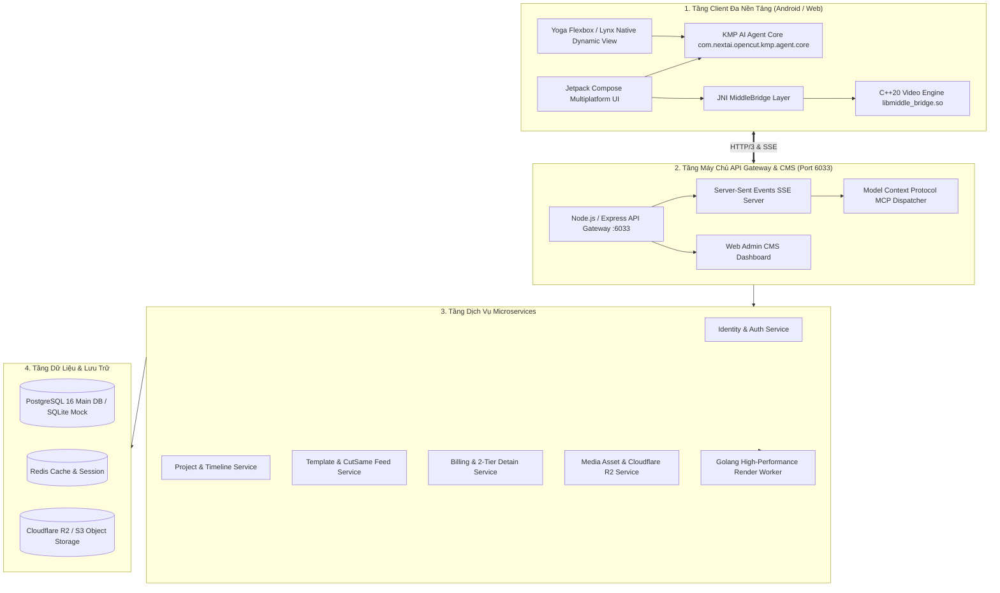

# Docs/Architecture/overview.md — TỔNG QUAN KIẾN TRÚC HỆ THỐNG NEXTAI OPENCUT

```mermaid
graph TD
    subgraph ClientLayer["1. Tầng Client Đa Nền Tảng (Android / Web)"]
        ComposeUI[Jetpack Compose Multiplatform UI]
        LynxUI[Yoga Flexbox / Lynx Native Dynamic View]
        KmpCore[KMP AI Agent Core com.nextai.opencut.kmp.agent.core]
        JniBridge[JNI MiddleBridge Layer]
        NativeEngine[C++20 Video Engine libmiddle_bridge.so]
        
        ComposeUI --> KmpCore
        LynxUI --> KmpCore
        ComposeUI --> JniBridge
        JniBridge --> NativeEngine
    end

    subgraph GatewayLayer["2. Tầng Máy Chủ API Gateway & CMS (Port 6033)"]
        APIGateway[Node.js / Express API Gateway :6033]
        SSEStream[Server-Sent Events SSE Server]
        AdminCMS[Web Admin CMS Dashboard]
        MCPOrchestrator[Model Context Protocol MCP Dispatcher]
        
        APIGateway --> SSEStream
        APIGateway --> AdminCMS
        SSEStream --> MCPOrchestrator
    end

    subgraph ServiceLayer["3. Tầng Dịch Vụ Microservices"]
        AuthSvc[Identity & Auth Service]
        EditorSvc[Project & Timeline Service]
        TemplateSvc[Template & CutSame Feed Service]
        CommerceSvc[Billing & 2-Tier Detain Service]
        AssetSvc[Media Asset & Cloudflare R2 Service]
        GoWorker[Golang High-Performance Render Worker]
    end

    subgraph DataLayer["4. Tầng Dữ Liệu & Lưu Trữ"]
        PostgresDB[(PostgreSQL 16 Main DB / SQLite Mock)]
        RedisCache[(Redis Cache & Session)]
        CloudflareStore[(Cloudflare R2 / S3 Object Storage)]
    end

    ClientLayer <== HTTP/3 & SSE ==> GatewayLayer
    GatewayLayer --> ServiceLayer
    ServiceLayer --> DataLayer
    ServiceLayer --> GoWorker
```
